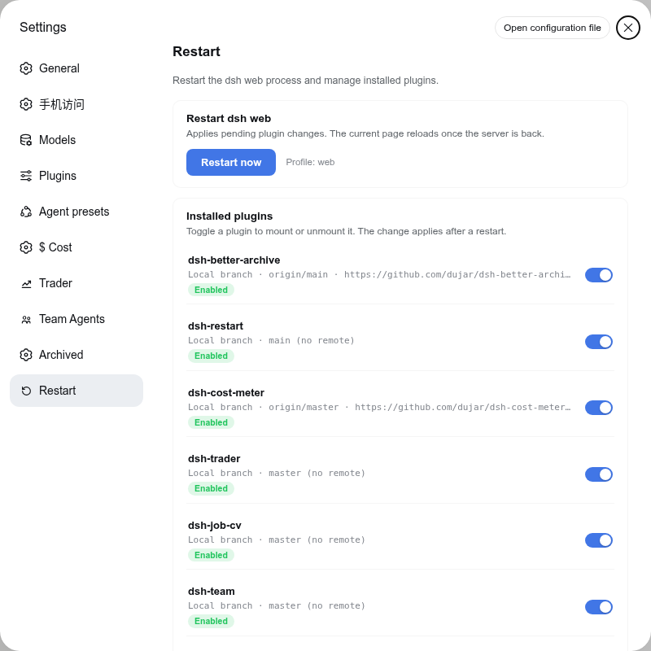
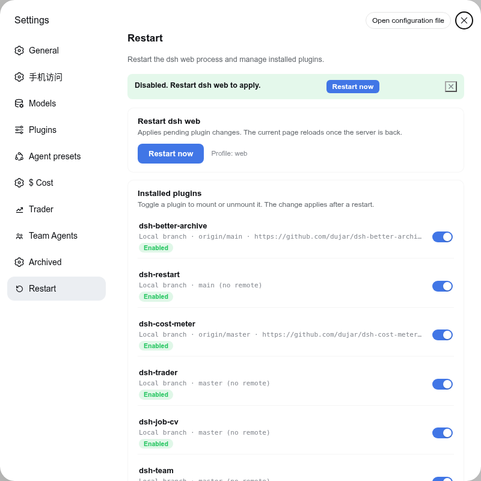
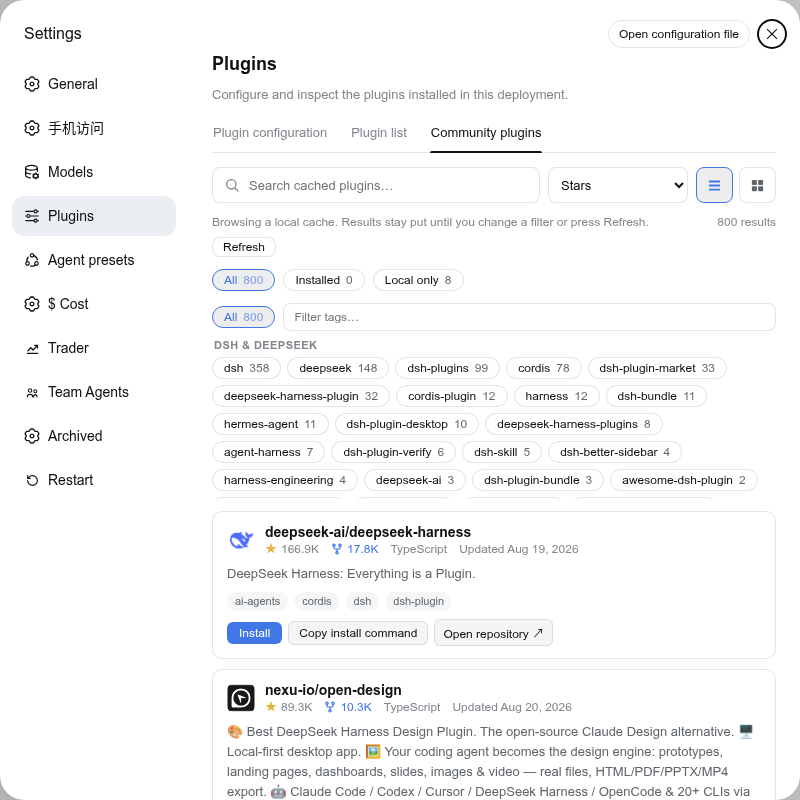

# dsh-restart

A [DeepSeek Harness](https://github.com/deepseek-ai/deepseek-harness) (DSH) plugin that adds a **Settings → Restart** section: restart the `dsh web` process in one click, enable/disable installed plugins, and jump straight to the Community plugins tab to install more. Bilingual UI (English / Simplified Chinese) that follows the host's global language setting and switches live.

## Features

- **Restart dsh web** — one button restarts the host web process. The restarter is a detached helper that polls until the port is actually released (up to 20 s) before relaunching, so a slow-shutting-down old process cannot make the new one die with `EADDRINUSE`; the new instance inherits the original terminal's stdio and the page reloads itself once the server is back.
- **Enable / disable installed plugins** — lists every third-party plugin of the active profile (union of `dsh.profile.bundles` and `dependencies`, excluding `@deepseek-ai/*` and `cordis:*` built-ins) with a toggle per plugin that edits the profile manifest (`dsh.profile.bundles`); changes apply after a restart. Rows with a pending change show a **Restart to apply** chip, and a notice bar offers a one-click restart. Plugins installed from a local checkout (`link:`/`file:` specs) additionally show git metadata when it is already present on disk — **local build** vs **local branch**, the current branch, the first remote's name/URL (e.g. `Local branch · origin/main · https://github.com/dujar/dsh-pocket.git`) — read from `.git` only, no network, worktrees included.
- **More plugins** — when dsh-community-plugins is installed and enabled, a button jumps straight to **Settings → Plugins → Community plugins**; otherwise the card advertises **dujar/dsh-community-plugin** with a one-click install (runs `dsh plugin --profile <p> add github:dujar/dsh-community-plugin`) and a link to the repository.
- **Fail-closed trust guard** — all routes reuse the same-origin/localhost check shared with dsh-trader and dsh-community-plugins.

## Screenshots

Settings → Restart section (English):



Toggling a plugin shows the pending state and a restart shortcut:



The *More plugins* button redirects in-app to the Community plugins tab:



## Install

> Requires Node.js 22.19+ and pnpm (`dsh plugin` installs through pnpm under the hood).

```sh
# local checkout (development)
dsh plugin --profile web add /path/to/dsh-restart

# from a git remote (after publishing)
dsh plugin --profile web add github:<you>/dsh-restart
```

Then **restart `dsh web`** and refresh the browser page. The install adds `dsh-restart` to the profile's `dsh.profile.bundles` automatically; if it is not added, append `"dsh-restart"` to that array in `$DSH_HOME/profiles/web/package.json` and restart. A **Restart** section then appears at the bottom of the Settings sidebar.

## Usage

1. Open **Settings → Restart**.
2. **Restart now** restarts the dsh web process; the page reloads once the new instance answers.
3. Toggle any plugin to mount/unmount it — the profile manifest is updated immediately, and the change is applied after a restart. The **Restart to apply** chip and the notice bar's *Restart* button show you exactly what is pending.
4. **Browse more plugins** opens **Settings → Plugins → Community plugins**, where you can search and install from the community catalog (via dsh-community-plugins).

## Host routes

| Method | Path | Purpose |
| --- | --- | --- |
| GET | `/dsh-restart/state` | profile, installed plugins (with enabled state + local git metadata), dsh-community-plugins availability |
| POST | `/dsh-restart/plugin` | `{ name, enabled }` — add/remove a `dsh.profile.bundles` entry |
| POST | `/dsh-restart/community` | one-click install of `github:dujar/dsh-community-plugin` (`DSH_BIN` overrides the executable) |
| POST | `/dsh-restart` | schedule a self-restart; responds `{ ok, restarting }`, then the process exits ~400 ms later |

All routes use the fail-closed same-origin/localhost trust check shared with dsh-trader and dsh-community-plugins: a cross-origin or malformed `Origin`/`Referer` rejects, a CORS-simple content type rejects, and only then does a localhost host count as trusted.

## Configuration

Environment variables (all optional):

| Variable | Default | Purpose |
| --- | --- | --- |
| `DSH_RESTART_CMD` | original command line | Custom restart command (e.g. `systemctl restart dsh-web`) for supervised setups. |
| `DSH_RESTART_PROFILE` | auto-detected | Explicit profile; falls back to `DSH_PROFILE`, then auto-detection of the profile that mounted this plugin, then `web`. |

## Development

Zero-build plugin (same pattern as dsh-community-plugins / dsh-better-archive):

```sh
npm test          # host routes + client contract/dict balance + real-React SSR
node --check lib/index.js && node --check lib/client.js
```

- Client: `lib/client.js` (CJS factory + ModuleLoader; React comes from the host).
- Host: `lib/index.js` (`ctx.webServer.register` mounts the routes).
- i18n: `ctx.locale.register('restart', { zh, en })` — the host enforces zh/en key parity, so every new string must land in both dictionaries.

## Publishing

Before publishing your fork to GitHub: add the [`dsh-plugin`](https://github.com/topics/dsh-plugin) topic to the repository for discoverability in the community catalog (per the DeepSeek Harness README).

## License

[MIT](./LICENSE)
