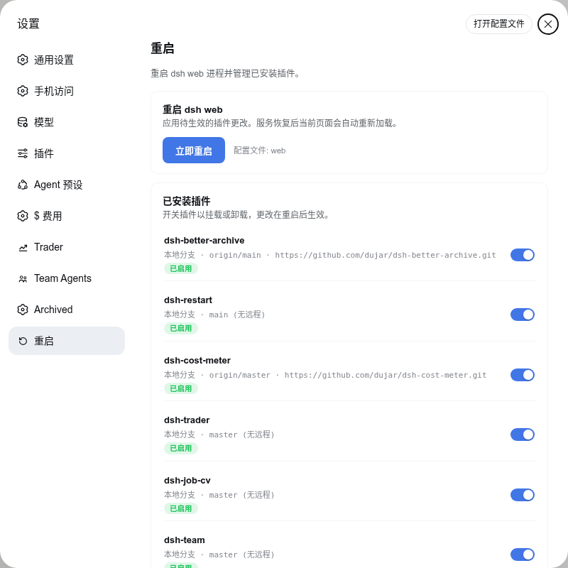
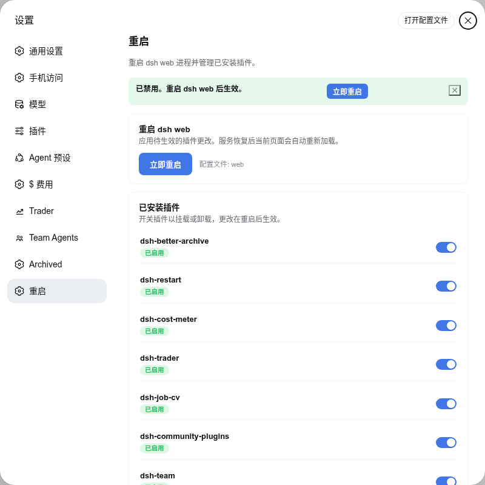
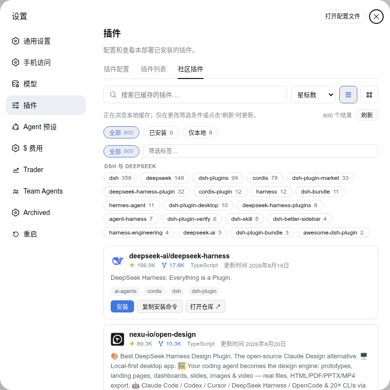
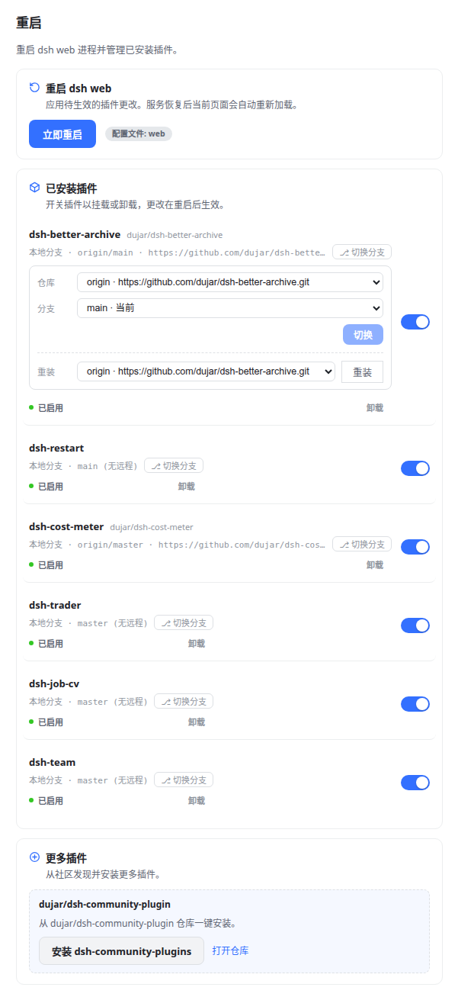

# dsh-restart

[English](README.md) | 简体中文

[DeepSeek Harness](https://github.com/deepseek-ai/deepseek-harness)（DSH）web-GUI 插件：在 **设置 → 重启** 中一键重启 `dsh web` 进程、开关已安装插件，并直接跳转社区插件页安装更多。中英双语界面（跟随宿主全局语言，zh / en，实时切换）。

## 功能

- **重启 dsh web** — 单个按钮重启宿主 web 进程。重启器为 detached 辅助进程，轮询等待端口真正释放（最长 20s）后再拉起新进程，避免旧进程退出慢导致新进程 `EADDRINUSE` 静默崩溃；新实例继承原终端的 stdio，服务恢复后页面自动重新加载。
- **启停已安装插件** — 列出当前 profile 的全部第三方插件（`dsh.profile.bundles` 与 `dependencies` 的并集，排除 `@deepseek-ai/*` 与 `cordis:*` 内置项），每个插件一个开关，直接写入 profile 清单（`dsh.profile.bundles`），重启后生效。行首以状态点（绿色 / 灰色）显示启用状态，所有异步操作（重启、安装、切换分支、卸载等）均带加载指示。已改未重启的行显示「重启后生效」标记，通知栏提供一键重启。本地安装的插件（`link:`/`file:` 规格）额外显示磁盘上已存在的 git 信息 —— **本地构建** 或 **本地分支**、当前分支、首个远程的名称与地址（如 `本地分支 · origin/main · https://github.com/dujar/dsh-pocket.git`）—— 仅读取 `.git`，无网络请求，支持 worktree。
- **更多插件** — 检测到 dsh-community-plugins 已安装并启用时，按钮直接跳转 **设置 → 插件 → 社区插件** 页；未安装时卡片广告 **dujar/dsh-community-plugins**，提供一键安装（执行 `dsh plugin --profile <p> add github:dujar/dsh-community-plugins`）与仓库链接。
- **切换分支与重装** — 本地 git 检出获得 Git 面板（⎇）：跨仓库（本地 / origin / upstream）切换分支（同名分支自动改设跟踪）；*重装* 为独立的虚线分组区域，二次确认前按钮为中性样式、确认后变为红色警示。来源三选一：**本地**（`git reset --hard` + `git clean -fdx`）、该插件自己的任一远程（fetch 后硬重置到默认分支）、或**插件源（npm）**（执行 `dsh plugin --profile <p> add <name>@latest`，替换 `link:` 规格 — 本地检出保留在磁盘，重启后加载 npm 发布版；想切回本地检出执行 `dsh plugin --profile <p> add link:<路径>`）。本地/远程重装后自动恢复检出的运行时依赖（`git clean -fdx` 会清掉 node_modules，按 `package-lock.json` → npm / `pnpm-lock.yaml` → pnpm / 有依赖无锁文件 → npm 自动选择装回），并在链接断开时自动修复。
- **链接健康与一键修复** — state 检查 `node_modules/<插件>` 与 `link:`/`file:` 清单规格是否一致：真实目录 / 缺失 / 指向他处即显示「链接已断开 — DSH 正在加载旧副本」警告（典型场景：`dsh plugin add github:...` 把本地链接换成了 tarball 副本）。点 **修复链接** 执行 `dsh plugin --profile <p> install`，pnpm 依清单恢复符号链接并重写锁文件。
- **卸载** — 每行插件提供二次确认的卸载，从 `dsh.profile.bundles` 与 `dependencies` 移除（内置包拒绝）；磁盘文件保留不动。
- **fail-closed 信任校验** — 所有路由沿用 dsh-trader / dsh-community-plugins 的同源/localhost 校验。

## 截图

设置 → 重启 分区（中文界面）：



切换插件开关后显示待生效状态与重启快捷入口：



「浏览更多插件」跳转社区插件页：



Git 面板 — 跨仓库（本地 / origin / upstream）切换分支，并可从同一来源重装（全新清理）：



## 安装

> 需要 Node.js 22.19+ 与 pnpm（`dsh plugin` 底层通过 pnpm 安装）。

```sh
# 本地开发
dsh plugin --profile web add /path/to/dsh-restart

# 从 GitHub 安装
dsh plugin --profile web add github:dujar/dsh-restart
```

然后**重启 `dsh web`** 并刷新浏览器页面。安装会自动把 `dsh-restart` 加入 profile 的 `dsh.profile.bundles`；若未加入，请手动把 `"dsh-restart"` 追加到 `$DSH_HOME/profiles/web/package.json` 的该数组并重启。设置侧边栏底部即出现「重启」分区。

## 使用

1. 打开 **设置 → 重启**。
2. **立即重启** 重启 dsh web 进程；新实例就绪后页面自动重新加载。
3. 切换任意插件的开关以挂载/卸载 — profile 清单立即更新，重启后生效。「重启后生效」标记与通知栏的 *重启* 按钮会明确提示当前待生效的更改。
4. **浏览更多插件** 打开 **设置 → 插件 → 社区插件**，可搜索并从社区目录安装（由 dsh-community-plugins 提供）。
5. 本地检出插件可点 **⎇ 切换分支** 打开 Git 面板：选择仓库（本地 / 各远程）与分支 — 从不同仓库选择同名分支会改设跟踪（`git branch --set-upstream-to` / `--unset-upstream`）而非无效操作。下方的 **重装** 行即全新清理，来源三选一（均需二次确认）：*本地* 丢弃全部本地改动与未跟踪文件（`git reset --hard` + `git clean -fdx`），远程则 fetch 后硬重置到该远程默认分支，*插件源（npm）* 则从注册表重装最新版（`dsh plugin add <name>@latest`，本地检出保留在磁盘但不再被加载）。本地/远程重装会自动把 `git clean -fdx` 清掉的 node_modules 装回检出，并在链接断开时自动修复。链接健康状态显示在每行：出现「链接已断开」警告时点 **修复链接** 即可恢复。
6. **卸载**（行尾）将该插件从 `dsh.profile.bundles` 与 `dependencies` 移除 — 重启后生效；磁盘上的检出文件保留不动。

## 路由（宿主半）

| 方法 | 路径 | 说明 |
| --- | --- | --- |
| GET | `/dsh-restart/state` | profile、已安装插件列表（含 enabled、本地 git 元信息与链接健康）、dsh-community-plugins 可用性 |
| POST | `/dsh-restart/plugin` | `{ name, enabled }` — 增删 `dsh.profile.bundles` 成员 |
| POST | `/dsh-restart/community` | 一键安装 `github:dujar/dsh-community-plugins`（`DSH_BIN` 可覆盖可执行文件） |
| GET | `/dsh-restart/git-refs` | `?name=<插件>` — 本地检出的分支与远程引用（无网络） |
| POST | `/dsh-restart/git-checkout` | `{ name, branch, remote }` — 切换分支（按仓库调整跟踪） |
| POST | `/dsh-restart/uninstall` | `{ name }` — 从 bundles 与 dependencies 移除（内置包拒绝） |
| POST | `/dsh-restart/relink` | `{ name }` — 重新同步 profile 安装，恢复被覆盖的 `link:`/`file:` 依赖符号链接 |
| POST | `/dsh-restart/reinstall` | `{ name, remote }` — 全新清理本地检出（本地或该插件自己的 git 远程；`remote: "plugin"` 改为从注册表重装并解链）；完成后恢复检出依赖并修复断开的链接 |
| POST | `/dsh-restart` | 调度自重启；先返回 `{ ok, restarting }`，约 400 ms 后进程退出 |

所有路由使用与 dsh-trader / dsh-community-plugins 相同的 fail-closed 同源/localhost 信任校验：跨源或异常的 `Origin`/`Referer` 一律拒绝，CORS-simple 类型拒绝，仅当 Host 为 localhost 时才视为可信。

## 配置

环境变量（均可选）：

| 变量 | 默认值 | 说明 |
| --- | --- | --- |
| `DSH_RESTART_CMD` | 原启动命令行 | 自定义重启命令（如 `systemctl restart dsh-web`），用于 systemd 等托管场景。 |
| `DSH_RESTART_PROFILE` | 自动检测 | 指定 profile；回退 `DSH_PROFILE` → 自动检测挂载本插件的 profile → `web`。 |

## 开发

零构建插件（同 dsh-community-plugins / dsh-better-archive 模式）：

```sh
npm test          # host 路由 + client 契约/字典平衡 + 真实 React 服务端渲染
node --check lib/index.js && node --check lib/client.js
```

- 客户端：`lib/client.js`（CJS factory + ModuleLoader，React 来自宿主）。
- 宿主：`lib/index.js`（`ctx.webServer.register` 挂载路由）。
- i18n：`ctx.locale.register('restart', { zh, en })` — 宿主强制 zh/en 键对等，新增文案必须同时加两个字典。

## 项目结构

```
dsh-restart/
  package.json         # manifest（dsh.bundle.patch / dsh.client 声明）
  cordis.patch.yml     # 宿主半挂载行（由 profile bundle 机制应用）
  lib/
    index.js           # 宿主半：重启调度 + 插件开关 / Git 面板路由
    client.js          # 浏览器半：设置分区 UI（React，零构建，双语）
  test/
    host.test.mjs      # 路由、信任校验、重启交接
    client.test.mjs    # bundle 契约、字典键对等、pollRestart
    render.test.mjs    # 真实 React 服务端渲染
  LICENSE
  README.md           # 英文（主文件）
  README.zh-CN.md     # 简体中文（本文件）
```

## 发布

发布到 GitHub 前，请为仓库添加 [`dsh-plugin`](https://github.com/topics/dsh-plugin) 主题标签，以便在社区目录中被发现（DeepSeek Harness 官方 README 的要求）。

## 许可

[MIT](./LICENSE)
